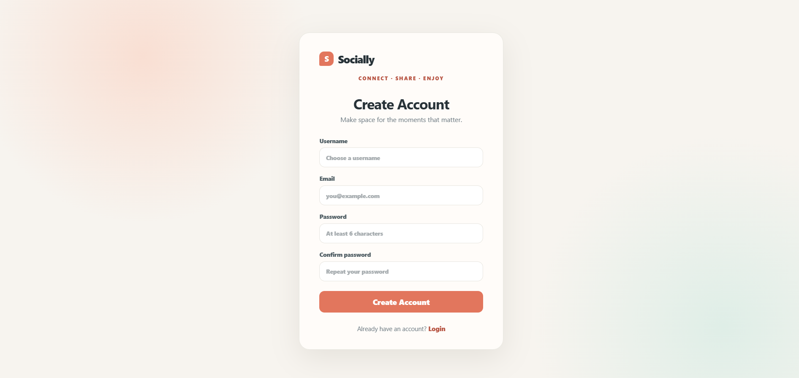
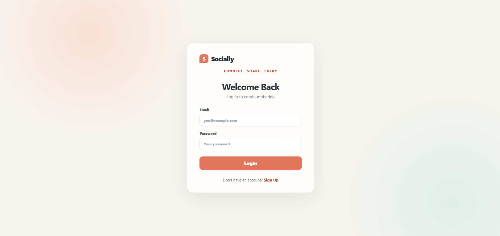
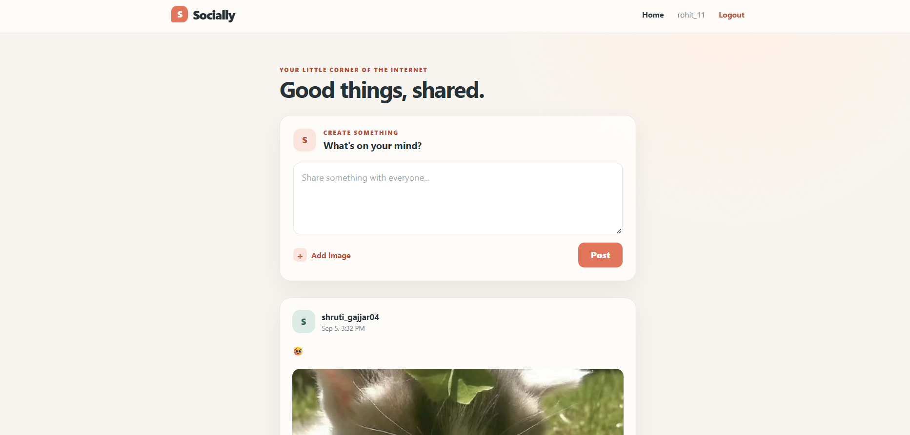
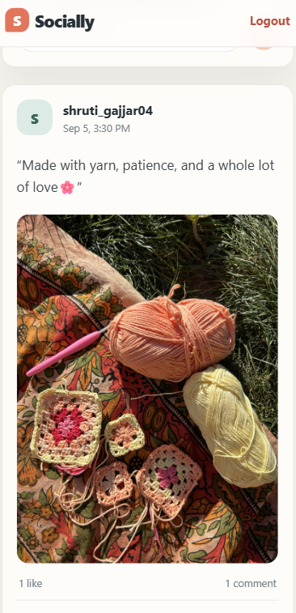

# ✨ Socially — Mini Social Post Application

> A modern, responsive full-stack social media application built as a Full Stack Developer Internship Assessment.

Socially allows users to create accounts, share text and images, explore a public feed, like posts, and comment on posts through a clean and responsive interface.

---

## 🌐 Live Demo

🚀 **Frontend:** Coming Soon  
⚙️ **Backend API:** Coming Soon

> Live deployment links will be added after deployment.

---

## 📸 About the Project

Socially is a mini social media platform where users can:

- 🔐 Create an account and log in securely
- 📝 Create posts with text, images, or both
- 📰 View a public feed containing posts from all users
- ❤️ Like and unlike posts
- 💬 Add comments to posts
- 👤 View usernames associated with likes and comments
- 📱 Use the application across mobile, tablet, and desktop devices
- ⚡ Load posts efficiently using pagination

The project focuses on clean UI, responsive design, reusable components, REST API architecture, and MongoDB data modeling.

---

## ✨ Key Features

### 🔐 Authentication

- User registration
- User login
- Password hashing using bcrypt
- JWT-based authentication
- Protected post interactions

### 📝 Posts

- Create text-only posts
- Create image-only posts
- Create posts with both text and images
- Public social feed
- Newest posts displayed first
- Image upload support

### ❤️ Likes

- Like a post
- Unlike a post
- Display total like count
- Store usernames of users who liked a post

### 💬 Comments

- Add comments to posts
- Display comments
- Display total comment count
- Store commenter usernames

### ⚡ Efficient Pagination

- Posts are loaded in batches
- MongoDB pagination using `skip()` and `limit()`
- Load More functionality
- Prevents loading the entire feed at once
- Avoids duplicate posts while loading additional pages

### 📱 Responsive & Optimized UI

- Mobile-friendly design
- Tablet-friendly design
- Desktop-friendly design
- Fluid responsive layouts
- Responsive forms and cards
- Responsive images
- No horizontal overflow

---

## 🎨 UI & Design

Socially uses a clean, modern, and minimal interface inspired by contemporary social media platforms.

### Design Highlights

- ✨ Modern authentication screens
- 📰 Clean social feed
- 🃏 Card-based post layout
- 👤 User avatars and usernames
- ❤️ Interactive like/unlike controls
- 💬 Integrated comment section
- 📱 Mobile-first responsive behavior
- 🎯 Consistent spacing and typography

---

## Screenshots

### Signup Page


### Login Page


### Home / Feed


### Responsive Mobile View


## 🛠️ Tech Stack

### Frontend

- React.js
- Vite
- React Router
- Axios
- CSS

### Backend

- Node.js
- Express.js
- MongoDB
- Mongoose
- JWT
- bcryptjs
- Multer
- CORS
- dotenv

### Deployment

- Vercel — Frontend
- Render — Backend
- MongoDB Atlas — Database

---

## 🏗️ Project Structure

```text
3W-Social-Post-App/
│
├── frontend/
│   ├── public/
│   ├── src/
│   │   ├── components/
│   │   ├── pages/
│   │   ├── App.jsx
│   │   ├── App.css
│   │   ├── index.css
│   │   └── ...
│   ├── package.json
│   └── ...
│
├── backend/
│   ├── config/
│   ├── controllers/
│   ├── middleware/
│   ├── models/
│   ├── routes/
│   ├── uploads/
│   ├── server.js
│   ├── package.json
│   └── ...
│
├── .gitignore
└── README.md
```

---

## 🗄️ Database Structure

The application intentionally uses exactly **two MongoDB collections**:

### 👤 Users Collection

Stores:

- Username
- Email
- Hashed password
- Timestamps

### 📝 Posts Collection

Stores:

- Post creator
- Username
- Text
- Image
- Likes
- Comments
- Timestamps

Likes and comments are embedded inside the `posts` collection instead of using separate collections.

---

## 🔌 API Endpoints

### Authentication

| Method | Endpoint | Description |
|---|---|---|
| POST | `/api/auth/signup` | Create a new user account |
| POST | `/api/auth/login` | Authenticate a user |

### Posts

| Method | Endpoint | Description |
|---|---|---|
| GET | `/api/posts?page=1&limit=10` | Get paginated posts |
| POST | `/api/posts` | Create a new post |
| POST | `/api/posts/:id/like` | Like or unlike a post |
| POST | `/api/posts/:id/comment` | Add a comment to a post |

Protected endpoints use JWT Bearer authentication.

---

## ⚡ Pagination

The feed uses server-side pagination.

Example:

```text
GET /api/posts?page=1&limit=10
```

The backend returns pagination information such as:

```json
{
  "posts": [],
  "pagination": {
    "currentPage": 1,
    "totalPages": 5,
    "totalPosts": 47,
    "hasMore": true
  }
}
```

The frontend uses this information to load additional posts without requesting the entire feed again.

---

## ⚙️ Getting Started

### 1. Clone the Repository

```bash
git clone YOUR_GITHUB_REPOSITORY_URL
cd 3W-Social-Post-App
```

---

### 2. Backend Setup

```bash
cd backend
npm install
```

Create a `.env` file inside the `backend` folder:

```env
PORT=3000
MONGODB_URI=YOUR_MONGODB_CONNECTION_STRING
JWT_SECRET=YOUR_SECRET_KEY
```

Start the backend:

```bash
npm run dev
```

The backend will run on:

```text
http://localhost:3000
```

---

### 3. Frontend Setup

Open a new terminal:

```bash
cd frontend
npm install
```

Create a `.env` file inside the `frontend` folder:

```env
VITE_API_URL=http://localhost:3000/api
```

Start the frontend:

```bash
npm run dev
```

Open:

```text
http://localhost:5173
```

---

## 🔒 Environment Variables

Environment files contain sensitive configuration and should never be committed to GitHub.

### Backend

```env
PORT=
MONGODB_URI=
JWT_SECRET=
```

### Frontend

```env
VITE_API_URL=
```

The `.env` files are excluded using `.gitignore`.

---

## 🧪 Testing & Validation

The application has been tested for:

- ✅ User registration
- ✅ User login
- ✅ JWT authentication
- ✅ Text posts
- ✅ Image posts
- ✅ Text + image posts
- ✅ Public feed
- ✅ Like / Unlike
- ✅ Comments
- ✅ Like and comment counts
- ✅ Pagination
- ✅ Image display
- ✅ Responsive layouts
- ✅ Mobile compatibility
- ✅ Production build
- ✅ Reusable React components

---

## ♻️ Reusable Code

The frontend follows a component-based structure to keep the code maintainable and reusable.

Key reusable components include:

- `Navbar`
- `CreatePost`
- `PostCard`
- `CommentSection`

API communication is centralized through the frontend API service instead of duplicating Axios configuration throughout components.

---

## 📋 Assessment Highlights

This project focuses on the following development practices:

### 🏆 Clean & Modern UI

A simple and modern social-media-inspired interface with consistent components and visual hierarchy.

### 📱 Responsive & Optimized Layout

The interface adapts to mobile, tablet, and desktop viewport sizes without horizontal overflow.

### ⚡ Efficient Pagination

Posts are fetched in batches instead of loading all posts at once.

### ♻️ Reusable Code

The application uses reusable React components and a centralized API service.

### 📝 Code Comments & Best Practices

The project follows a modular folder structure, meaningful naming, environment variable usage, protected API routes, and focused code comments where appropriate.

---

## 🚀 Deployment Architecture

```text
                    ┌─────────────────┐
                    │     GitHub      │
                    │  Source Code    │
                    └────────┬────────┘
                             │
                ┌────────────┴────────────┐
                ↓                         ↓
        ┌───────────────┐         ┌───────────────┐
        │    Vercel     │         │    Render     │
        │   Frontend    │────────→│    Backend    │
        └───────────────┘         └───────┬───────┘
                                         │
                                         ↓
                                  ┌───────────────┐
                                  │ MongoDB Atlas │
                                  │   Database    │
                                  └───────────────┘
```

---

## 🔮 Future Improvements

Possible future improvements include:

- Infinite scrolling
- User profiles
- Post editing
- Notifications
- Search functionality
- Real-time interactions
- Image optimization
- Cloud-based image storage

---

## 👩‍💻 Author

### Shruti

**Full Stack Developer | MERN Stack**

Built with ❤️ using React, Node.js, Express, and MongoDB.

---

## 🎓 Internship Assessment

Developed as part of the **3W Business Private Limited — Full Stack Developer Internship Assessment**.

---

⭐ **If you find this project interesting, feel free to explore the code and try the application.**